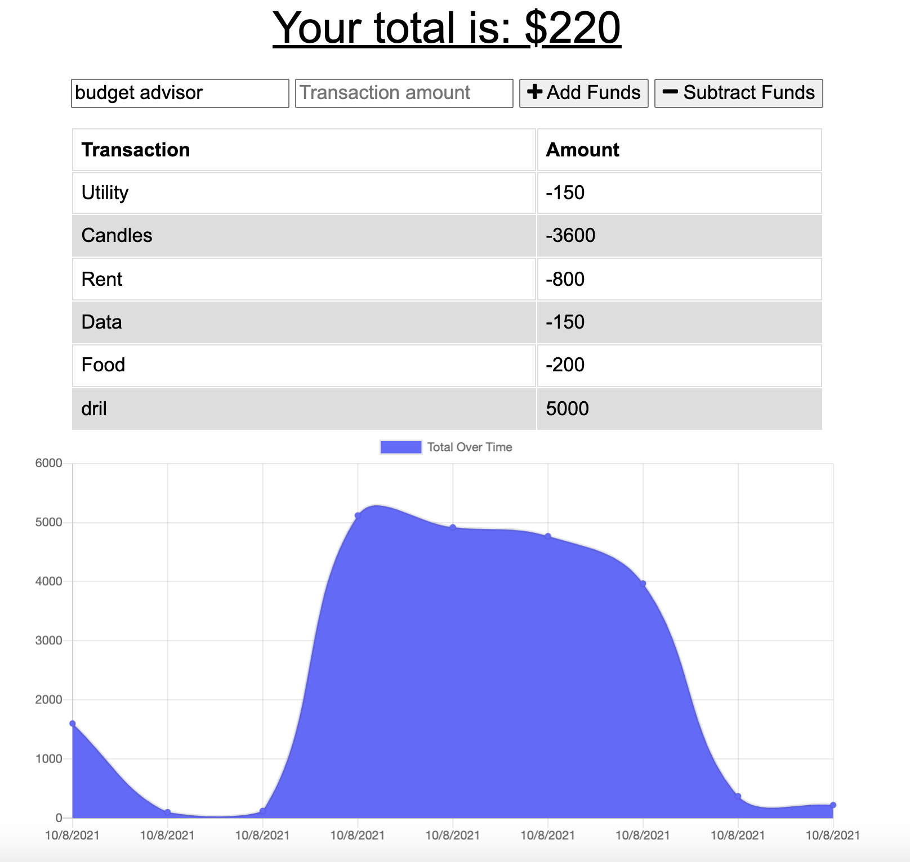

# Budget Tracker Refactor

A project for refactoring an existing budget tracking app to allow it to work as a PWA

## Deployed Site on Heroku

https://salty-springs-11808.herokuapp.com/

## Features

- Service worker caches data for offline loading
- IndexedDB enables offline functionality
- Web manifest so the site can be downloaded as an app

## Other Technologies Used

- Database: MongoDB with Mongoose
- Deployment: MongoDB Atlas and Heroku
- Server: Express

## How to Use

Enter the name of the transaction you wish to add and the amount, then press the related button to either add or subtract it. Any changes made while offline will be applied when the connection is restored.

## About the Programmer

Kat Dixon is a developing developer with interests in accessibility, security, and the intersections between the two.